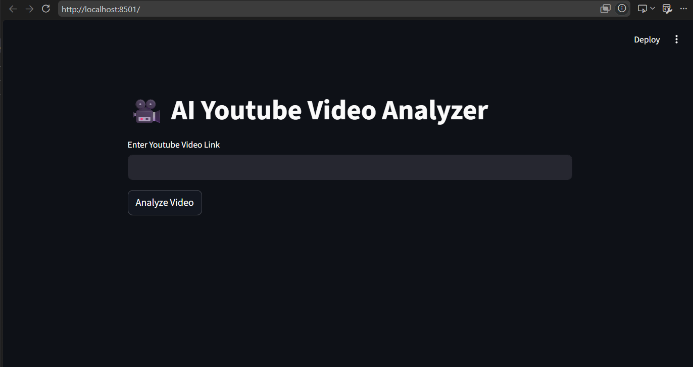
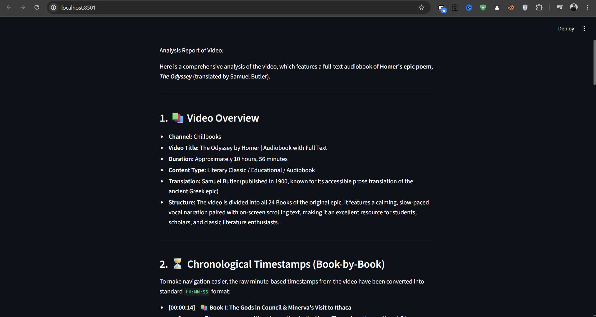

# 🎥 AI YouTube Video Analyzer

An AI-powered YouTube Video Analyzer that transforms long YouTube videos into structured, easy-to-read summaries with chapter-wise timestamps and key takeaways.

Built using **Python**, **Agno**, **Gemini/OpenAI APIs**, **YouTube Transcript API**, and **Streamlit**.

## 🚀 Live Demo

👉 **Try it here:**  
https://youtube-summarizer-by-himan.streamlit.app/

---

## ✨ Features

- 🎥 Analyze any YouTube video using its URL
- 📝 Generate detailed AI-powered summaries
- ⏱️ Create meaningful chapter-wise timestamps
- 📚 Organize long videos into structured sections
- 🧠 Understand video context using LLMs
- 💻 Simple and responsive Streamlit interface

---

## 🛠 Tech Stack

- Python
- Agno (Agent Framework)
- Google Gemini API
- OpenAI API
- YouTube Transcript API
- Streamlit

---

## 📸 Preview

### Home Page

> Paste any YouTube video link and click **Analyze Video**.



### AI Analysis

> The AI generates a structured summary with timestamps and key insights.



---

## ⚙️ Installation

Clone the repository:

```bash
git clone https://github.com/HimanshurajNimse/Youtube-Summarizer.git
```

Move into the project:

```bash
cd Youtube-Summarizer
```

Install dependencies:

```bash
pip install -r requirements.txt
```

Create a `.env` file:

```env
GOOGLE_API_KEY=your_api_key_here
```

Run the application:

```bash
streamlit run ui.py
```

---

## 💡 How It Works

1. Enter a YouTube video URL.
2. The application retrieves the transcript.
3. The AI agent analyzes the content.
4. A structured report is generated with:
   - Video overview
   - Chapter-wise timestamps
   - Topic summaries
   - Key takeaways

---

## 📂 Project Structure

```
Youtube-Summarizer/
│
├── ui.py               # Streamlit interface
├── yt.py               # AI Agent
├── requirements.txt
├── README.md
├── .gitignore
└── .env                # Local only (not committed)
```

---

## 🤝 Contributing

Contributions, suggestions, and improvements are always welcome!

Feel free to fork the repository and submit a pull request.

---

## ⭐ Support

If you found this project useful, consider giving it a ⭐ on GitHub!

It helps others discover the project and motivates me to build more AI tools.

---

## 👨‍💻 Author

**Himanshuraj Nimse**

GitHub: https://github.com/HimanshurajNimse

LinkedIn: *(Add your LinkedIn profile here)*
